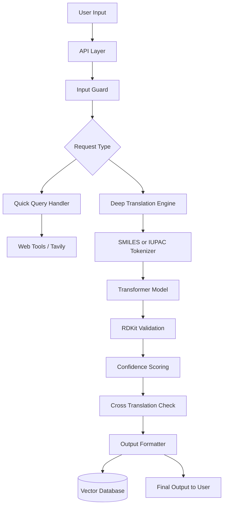
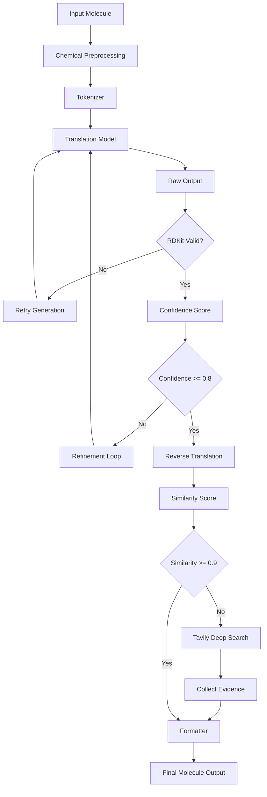
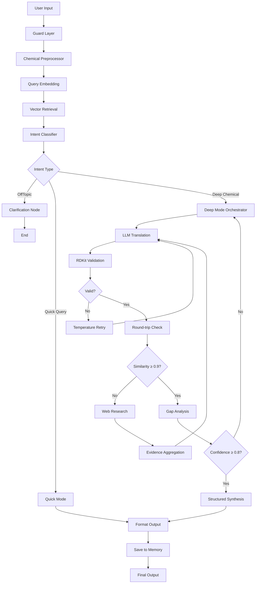

# GSOC-DeepChem
## Overall Architecture of the proposed idea.

```mermaid
graph TD

Start([Input: SMILES or IUPAC]) --> Guard[Input Guard / Sanitization]
Guard --> PreProc[Chemical Preprocessor]

subgraph Knowledge_Retrieval
    PreProc --> Embed[Embedding Model]
    Embed --> Vector[(Vector DB: Chemical Data / Past Queries)]
end

Vector --> Classify{Intent Classifier}

Classify -- OffTopic --> End([Reject or Clarify])

Classify -- Quick_Query --> Tools[Search Tools Tavily / Web]

Classify -- Deep_Chemical_Query --> Deep[Deep Mode Orchestrator]

subgraph Neural_Translation
    Deep --> Tokenizer[SMILES or IUPAC Tokenizer]
    Tokenizer --> Model{{Transformer Translation Model}}
    Model --> RawOutput[Raw Translation Output]
end

RawOutput --> Validity{RDKit Validity Check}

Validity -- Invalid --> Retry[Beam Search or Temperature Retry]
Retry --> Model

Validity -- Valid --> Confidence[Confidence Scoring Engine]

subgraph Confidence_Loop
    Confidence --> Score{Confidence >= 0.8}
    Score -- No --> Iterate[Refinement Iteration]
    Iterate --> Model
end

Score -- Yes --> CrossCheck[Bi Directional Translation]

subgraph Verification
    CrossCheck --> Reverse[Translate Back]
    Reverse --> Similarity[Tanimoto or String Similarity]
end

Similarity --> Verify{Similarity >= 0.9}

subgraph Deep_Research_Loop
    Tools --> Research[Tavily Deep Search]
    Research --> Evidence[Evidence Aggregation]
end

Verify -- Low --> Research
Evidence --> Formatter

Verify -- High --> Formatter

Formatter[Output Formatter]

Formatter --> Metrics[Update Benchmarks]
Formatter --> Memory[(Save to Vector DB)]
Formatter --> End([Final Molecule Output])
```

## System Architecture (High Level)

```mermaid
graph TD

User[User Input] --> API[API Layer]

API --> Guard[Input Guard]

Guard --> Router{Request Type}

Router --> Quick[Quick Query Handler]
Router --> Deep[Deep Translation Engine]

Quick --> Tools[Web Tools / Tavily]

Deep --> Tokenizer[SMILES or IUPAC Tokenizer]
Tokenizer --> Model[Transformer Model]

Model --> Validation[RDKit Validation]

Validation --> Confidence[Confidence Scoring]

Confidence --> Verification[Cross Translation Check]

Verification --> Formatter[Output Formatter]

Formatter --> Memory[(Vector Database)]

Formatter --> UserOut[Final Output to User]
```
## Inference / Agent Pipeline (Runtime reasoning loop)

```mermaid
graph TD

Start[Input Molecule]

Start --> Preprocess[Chemical Preprocessing]

Preprocess --> Tokenizer[Tokenizer]

Tokenizer --> Model[Translation Model]

Model --> Output[Raw Output]

Output --> Validity{RDKit Valid?}

Validity -- No --> Retry[Retry Generation]
Retry --> Model

Validity -- Yes --> Confidence[Confidence Score]

Confidence --> Check{Confidence >= 0.8}

Check -- No --> Iterate[Refinement Loop]
Iterate --> Model

Check -- Yes --> CrossCheck[Reverse Translation]

CrossCheck --> Similarity[Similarity Score]

Similarity --> Verify{Similarity >= 0.9}

Verify -- No --> Research[Tavily Deep Search]

Research --> Evidence[Collect Evidence]

Evidence --> Formatter

Verify -- Yes --> Formatter

Formatter --> Final[Final Molecule Output]
```

```mermaid
graph TD
    A[User Input] --> B[Guard Layer]
    B --> C[Chemical Preprocessor]
    C --> D[Query Embedding]
    D --> E[Vector Retrieval]
    E --> F[Intent Classifier]

    F --> G{Intent Type}
    G -->|OffTopic| H[Clarification Node]
    G -->|Quick Query| I[Quick Mode]
    G -->|Deep Chemical| J[Deep Mode Orchestrator]

    I --> K[Format Output]
    H --> L[End]

    J --> M[LLM Translation]
    M --> N[RDKit Validation]
    N --> O{Valid?}
    O -->|No| P[Temperature Retry]
    P --> M
    O -->|Yes| Q[Round-trip Check]
    Q --> R{Similarity ≥ 0.9?}
    R -->|No| S[Web Research]
    S --> T[Evidence Aggregation]
    T --> M
    R -->|Yes| U[Gap Analysis]
    U --> V{Confidence ≥ 0.8?}
    V -->|No| J
    V -->|Yes| W[Structured Synthesis]
    W --> K
    K --> X[Save to Memory]
    X --> Y[Final Output]
```

```mermaid
graph TD
    Start([📝 User Input]) --> Guard[Guard Layer<br/>init_tokens=0]
    Guard --> PreProc[Chemical Preprocessor<br/>detect format]
    
    PreProc --> Cache{QueryCache<br/>Hit?}
    Cache -->|Hit| CacheReturn["✅ Return<br/>from cache"]
    Cache -->|Miss| Embed[Query Embedding]
    
    CacheReturn --> Output([Final Output])
    
    Embed --> Vector[(Vector DB<br/>Context retrieval)]
    Vector --> Classify{Intent<br/>Classifier}
    
    Classify -->|OffTopic| Clarify[Clarification]
    Classify -->|Quick| Quick[Quick Mode]
    Classify -->|Chemical| Chemical[Chemical Mode]
    
    Clarify --> FormatOut[Format Output]
    
    Quick --> Execution[Execution Layer]
    Chemical --> CriticalCheck{Critical?}
    
    CriticalCheck -->|Yes| StereoEnrich[Stereochemistry Handler<br/>@/@@ detection]
    CriticalCheck -->|No| Execution
    
    StereoEnrich --> Execution
    
    Execution --> Primary["🎯 PRIMARY<br/>Seq2Seq Transformer<br/>+Beam Search"]
    Primary --> PrimaryScore{Confidence<br/>≥ 0.85?}
    
    PrimaryScore -->|Yes| ConfScore[ConfidenceScorer<br/>5-component]
    PrimaryScore -->|No| Secondary["⚡ SECONDARY<br/>Rule-based<br/>RDKit/PubChem"]
    
    Secondary --> SecScore{Valid?}
    SecScore -->|Yes| ConfScore
    SecScore -->|No| Tertiary["🔍 TERTIARY<br/>Research Loop<br/>Web Search"]
    
    Tertiary --> TertScore{Resolved?}
    TertScore -->|Yes| ConfScore
    TertScore -->|No| Emergency["🆘 EMERGENCY<br/>Structured Help<br/>Recommendations"]
    
    Emergency --> ConfScore
    
    ConfScore --> Refine{Confidence<br/>0.70-0.85?}
    Refine -->|Yes| Iterate["🔄 Iterative<br/>Refinement<br/>max 3 cycles"]
    Refine -->|No| Benchmark
    
    Iterate --> Benchmark["📊 Benchmark<br/>Metrics"]
    
    Benchmark --> BenchResults["calc EM% valid%<br/>Tanimoto EDT"]
    BenchResults --> BatchScale["⚙️ Scalability<br/>Batch inference"]
    
    BatchScale --> TokenCalc["📊 Token Tracking<br/>input/output"]
    TokenCalc --> CostCalc["💰 Cost Calc<br/>input_cost+output_cost"]
    CostCalc --> FormatOut
    
    FormatOut --> Display["🖼️ Display Results<br/>Cost|Tokens|Conf|Mode"]
    Display --> Memory[(💾 Save to Memory<br/>Cost metadata)]
    Memory --> Output
    
    style Primary fill:#d4f1d4
    style Secondary fill:#fff4e6
    style Tertiary fill:#ffe6e6
    style Emergency fill:#ffb3b3
    style ConfScore fill:#e6f3ff
    style StereoEnrich fill:#f0e6ff
    style ConfScore fill:#e6f3ff
```

```mermaid
graph TD
    Start([📝 User Input]) --> Guard[Guard Layer<br/>init_tokens=0]
    Guard --> PreProc[Chemical Preprocessor<br/>detect format]
    
    PreProc --> Cache{QueryCache<br/>Hit?}
    Cache -->|Hit| CacheReturn["✅ Return<br/>from cache"]
    Cache -->|Miss| Embed[Query Embedding]
    
    CacheReturn --> Output([Final Output])
    
    Embed --> Vector[(Vector DB<br/>Context retrieval)]
    Vector --> Classify{Intent<br/>Classifier}
    
    Classify -->|OffTopic| Clarify[Clarification]
    Classify -->|Quick| Quick[Quick Mode]
    Classify -->|Chemical| Chemical[Chemical Mode]
    
    Clarify --> FormatOut[Format Output]
    
    Quick --> Execution[Execution Layer]
    Chemical --> CriticalCheck{"Complex Molecule?<br/>(rings/stereo<br/>length > 15)"}
    
    CriticalCheck -->|Yes| StereoEnrich[Stereochemistry Handler<br/>@/@@ detection]
    CriticalCheck -->|No| Execution
    
    StereoEnrich --> Execution
    
    Execution --> Primary["🎯 PRIMARY<br/>Seq2Seq Transformer<br/>+Beam Search"]
    Primary --> PrimaryScore{Confidence<br/>≥ 0.85?}
    
    PrimaryScore -->|Yes| ConfScore[ConfidenceScorer<br/>5-component]
    PrimaryScore -->|No| Secondary["⚡ SECONDARY<br/>Rule-based<br/>RDKit/PubChem"]
    
    Secondary --> SecConfScore[Secondary<br/>Confidence Check]
    SecConfScore --> SecScore{Valid?}
    SecScore -->|Yes| ConfScore
    SecScore -->|No| Tertiary["🔍 TERTIARY<br/>PubChem/ChEMBL<br/>Trusted APIs"]
    
    Tertiary --> TertScore{Resolved?}
    TertScore -->|Yes| ConfScore
    TertScore -->|No| Emergency["🆘 EMERGENCY<br/>Top-K Candidates<br/>+ Explanation"]
    
    Emergency --> ConfScore
    
    ConfScore --> Refine{Confidence<br/>0.70-0.85?}
    Refine -->|Yes| Iterate["🔄 Iterative<br/>Refinement<br/>max 3 cycles"]
    Refine -->|No| Benchmark
    
    Iterate --> Benchmark["📊 Benchmark<br/>Metrics"]
    
    Benchmark --> BenchResults["calc EM% valid%<br/>Tanimoto EDT"]
    BenchResults --> BatchScale["⚙️ Scalability<br/>Batch inference"]
    
    BatchScale --> TokenCalc["📊 Token Tracking<br/>input/output"]
    TokenCalc --> CostCalc["💰 Cost Calc<br/>input_cost+output_cost"]
    CostCalc --> FormatOut
    
    FormatOut --> Display["🖼️ Display Results<br/>Cost|Tokens|Conf|Mode"]
    Display --> Memory[(💾 Save to Memory<br/>Cost metadata)]
    Memory --> Output
    
    style Primary fill:#d4f1d4
    style Secondary fill:#fff4e6
    style Tertiary fill:#ffe6e6
    style Emergency fill:#ffb3b3
    style ConfScore fill:#e6f3ff
    style StereoEnrich fill:#f0e6ff
```
