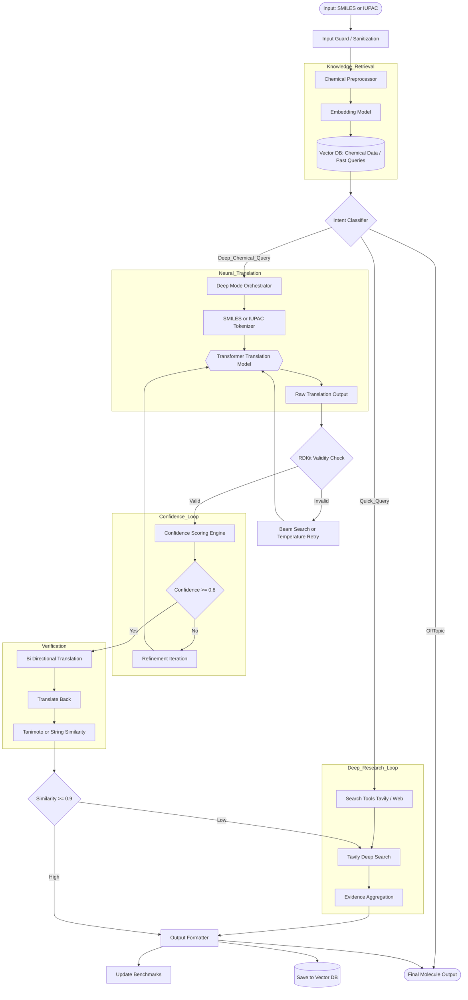

```mermaid
graph TD

Start([Input: SMILES or IUPAC]) --> Guard[Input Guard / Sanitization]
Guard --> PreProc[Chemical Preprocessor]

subgraph Knowledge_Retrieval
    PreProc --> Embed[Embedding Model]
    Embed --> Vector[(Vector DB: Chemical Data / Past Queries)]
end

Vector --> Classify{Intent Classifier}

Classify -- OffTopic --> End([Reject or Clarify])

Classify -- Quick_Query --> Tools[Search Tools Tavily / Web]

Classify -- Deep_Chemical_Query --> Deep[Deep Mode Orchestrator]

subgraph Neural_Translation
    Deep --> Tokenizer[SMILES or IUPAC Tokenizer]
    Tokenizer --> Model{{Transformer Translation Model}}
    Model --> RawOutput[Raw Translation Output]
end

RawOutput --> Validity{RDKit Validity Check}

Validity -- Invalid --> Retry[Beam Search or Temperature Retry]
Retry --> Model

Validity -- Valid --> Confidence[Confidence Scoring Engine]

subgraph Confidence_Loop
    Confidence --> Score{Confidence >= 0.8}
    Score -- No --> Iterate[Refinement Iteration]
    Iterate --> Model
end

Score -- Yes --> CrossCheck[Bi Directional Translation]

subgraph Verification
    CrossCheck --> Reverse[Translate Back]
    Reverse --> Similarity[Tanimoto or String Similarity]
end

Similarity --> Verify{Similarity >= 0.9}

subgraph Deep_Research_Loop
    Tools --> Research[Tavily Deep Search]
    Research --> Evidence[Evidence Aggregation]
end

Verify -- Low --> Research
Evidence --> Formatter

Verify -- High --> Formatter

Formatter[Output Formatter]

Formatter --> Metrics[Update Benchmarks]
Formatter --> Memory[(Save to Vector DB)]
Formatter --> End([Final Molecule Output])
```
