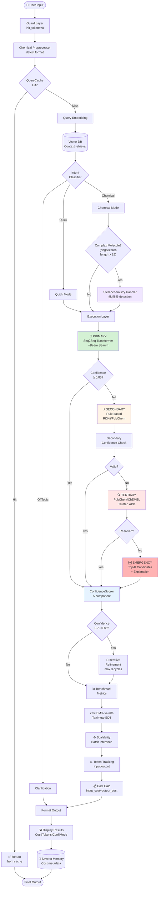

```mermaid
graph TD
    Start([📝 User Input]) --> Guard[Guard Layer<br/>init_tokens=0]
    Guard --> PreProc[Chemical Preprocessor<br/>detect format]
    
    PreProc --> Cache{QueryCache<br/>Hit?}
    Cache -->|Hit| CacheReturn["✅ Return<br/>from cache"]
    Cache -->|Miss| Embed[Query Embedding]
    
    CacheReturn --> Output([Final Output])
    
    Embed --> Vector[(Vector DB<br/>Context retrieval)]
    Vector --> Classify{Intent<br/>Classifier}
    
    Classify -->|OffTopic| Clarify[Clarification]
    Classify -->|Quick| Quick[Quick Mode]
    Classify -->|Chemical| Chemical[Chemical Mode]
    
    Clarify --> FormatOut[Format Output]
    
    Quick --> Execution[Execution Layer]
    Chemical --> CriticalCheck{"Complex Molecule?<br/>(rings/stereo<br/>length > 15)"}
    
    CriticalCheck -->|Yes| StereoEnrich[Stereochemistry Handler<br/>@/@@ detection]
    CriticalCheck -->|No| Execution
    
    StereoEnrich --> Execution
    
    Execution --> Primary["🎯 PRIMARY<br/>Seq2Seq Transformer<br/>+Beam Search"]
    Primary --> PrimaryScore{Confidence<br/>≥ 0.85?}
    
    PrimaryScore -->|Yes| ConfScore[ConfidenceScorer<br/>5-component]
    PrimaryScore -->|No| Secondary["⚡ SECONDARY<br/>Rule-based<br/>RDKit/PubChem"]
    
    Secondary --> SecConfScore[Secondary<br/>Confidence Check]
    SecConfScore --> SecScore{Valid?}
    SecScore -->|Yes| ConfScore
    SecScore -->|No| Tertiary["🔍 TERTIARY<br/>PubChem/ChEMBL<br/>Trusted APIs"]
    
    Tertiary --> TertScore{Resolved?}
    TertScore -->|Yes| ConfScore
    TertScore -->|No| Emergency["🆘 EMERGENCY<br/>Top-K Candidates<br/>+ Explanation"]
    
    Emergency --> ConfScore
    
    ConfScore --> Refine{Confidence<br/>0.70-0.85?}
    Refine -->|Yes| Iterate["🔄 Iterative<br/>Refinement<br/>max 3 cycles"]
    Refine -->|No| Benchmark
    
    Iterate --> Benchmark["📊 Benchmark<br/>Metrics"]
    
    Benchmark --> BenchResults["calc EM% valid%<br/>Tanimoto EDT"]
    BenchResults --> BatchScale["⚙️ Scalability<br/>Batch inference"]
    
    BatchScale --> TokenCalc["📊 Token Tracking<br/>input/output"]
    TokenCalc --> CostCalc["💰 Cost Calc<br/>input_cost+output_cost"]
    CostCalc --> FormatOut
    
    FormatOut --> Display["🖼️ Display Results<br/>Cost|Tokens|Conf|Mode"]
    Display --> Memory[(💾 Save to Memory<br/>Cost metadata)]
    Memory --> Output
    
    style Primary fill:#d4f1d4
    style Secondary fill:#fff4e6
    style Tertiary fill:#ffe6e6
    style Emergency fill:#ffb3b3
    style ConfScore fill:#e6f3ff
    style StereoEnrich fill:#f0e6ff
```
