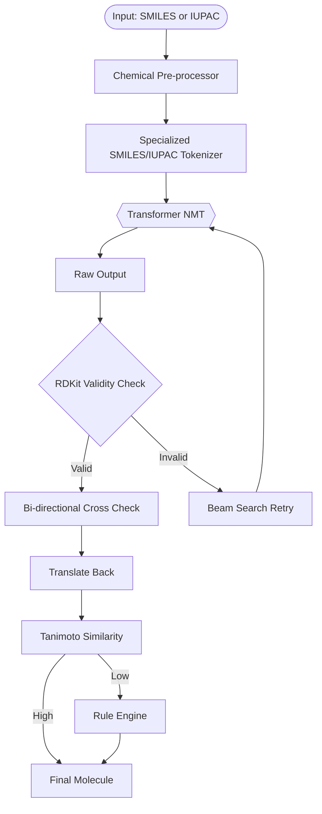

```mermaid
graph TD

Start([Input: SMILES or IUPAC]) --> PreProc[Chemical Pre-processor]
PreProc --> Tokenizer[Specialized SMILES/IUPAC Tokenizer]
Tokenizer --> Model{{Transformer NMT}}
Model --> RawOutput[Raw Output]

RawOutput --> ValidityCheck{RDKit Validity Check}

ValidityCheck -- Valid --> CrossCheck[Bi-directional Cross Check]
ValidityCheck -- Invalid --> Retry[Beam Search Retry]

Retry --> Model

CrossCheck --> ReTranslate[Translate Back]
ReTranslate --> Similarity[Tanimoto Similarity]

Similarity -- High --> Output[Final Molecule]
Similarity -- Low --> RuleBased[Rule Engine]

RuleBased --> Output
```
