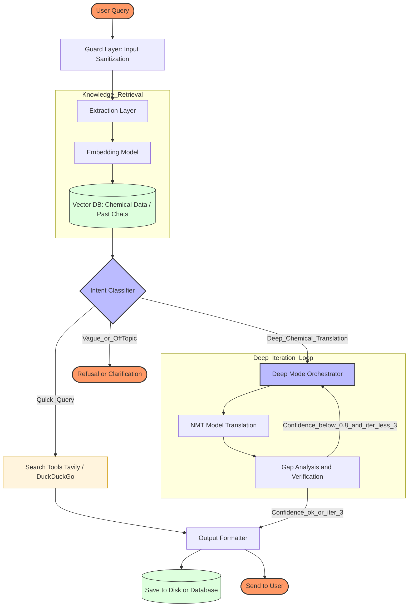

```mermaid
graph TD

%% Node Styles
classDef start_end fill:#f96,stroke:#333,stroke-width:2px;
classDef vector_db fill:#dfd,stroke:#333,stroke-width:1px;
classDef orchestrator fill:#bbf,stroke:#333,stroke-width:2px;
classDef tools fill:#fff4dd,stroke:#d4a017,stroke-width:1px;

Start([User Query]) --> Guard[Guard Layer: Input Sanitization]
Guard --> Extract[Extraction Layer]

subgraph Knowledge_Retrieval
    Extract --> Embed[Embedding Model]
    Embed --> RAG[(Vector DB: Chemical Data / Past Chats)]
end

RAG --> Classify{Intent Classifier}

Classify -- Vague_or_OffTopic --> End([Refusal or Clarification])

Classify -- Quick_Query --> Tools[Search Tools Tavily / DuckDuckGo]

Classify -- Deep_Chemical_Translation --> Deep[Deep Mode Orchestrator]

subgraph Deep_Iteration_Loop
    Deep --> Translation[NMT Model Translation]
    Translation --> Gap[Gap Analysis and Verification]
    Gap -- Confidence_below_0.8_and_iter_less_3 --> Deep
end

Tools --> Formatter[Output Formatter]

Gap -- Confidence_ok_or_iter_3 --> Formatter

Formatter --> Save[(Save to Disk or Database)]

Formatter --> User([Send to User])

class Start,End,User start_end
class RAG,Save vector_db
class Deep,Classify orchestrator
class Tools tools
```
