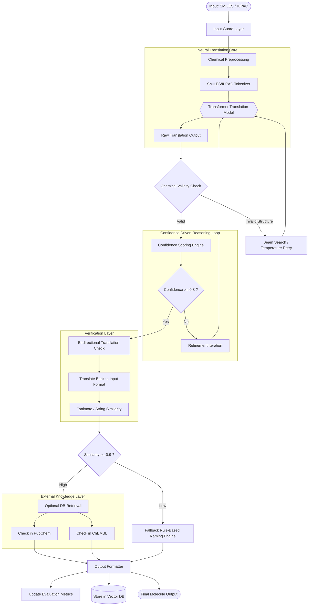

```mermaid
graph TD

%% INPUT LAYER
Start([Input: SMILES / IUPAC]) --> Guard[Input Guard Layer]
Guard --> PreProc[Chemical Preprocessing]

%% TRANSLATION CORE
subgraph "Neural Translation Core"
    PreProc --> Tokenizer[SMILES/IUPAC Tokenizer]
    Tokenizer --> Model{{Transformer Translation Model}}
    Model --> RawOutput[Raw Translation Output]
end

%% CHEMICAL VALIDATION
RawOutput --> Validity{Chemical Validity Check}

Validity -- Invalid Structure --> Retry[Beam Search / Temperature Retry]
Retry --> Model

Validity -- Valid --> ConfidenceEngine[Confidence Scoring Engine]

%% CONFIDENCE REASONING LOOP
subgraph "Confidence Driven Reasoning Loop"
    ConfidenceEngine --> Score{Confidence >= 0.8 ?}
    Score -- No --> Refine[Refinement Iteration]
    Refine --> Model
end

Score -- Yes --> CrossCheck[Bi-directional Translation Check]

%% VERIFICATION
subgraph "Verification Layer"
    CrossCheck --> Reverse[Translate Back to Input Format]
    Reverse --> Similarity[Tanimoto / String Similarity]
end

Similarity --> Verify{Similarity >= 0.9 ?}

%% KNOWLEDGE RETRIEVAL
Verify -- High --> Retrieval[Optional DB Retrieval]

subgraph "External Knowledge Layer"
    Retrieval --> PubChemCheck[Check in PubChem]
    Retrieval --> ChEMBLCheck[Check in ChEMBL]
end

PubChemCheck --> Formatter
ChEMBLCheck --> Formatter

%% FALLBACK ENGINE
Verify -- Low --> RuleEngine[Fallback Rule-Based Naming Engine]
RuleEngine --> Formatter

%% OUTPUT
Formatter[Output Formatter]

Formatter --> Metrics[Update Evaluation Metrics]
Formatter --> VectorDB[(Store in Vector DB)]
Formatter --> End([Final Molecule Output])
```
